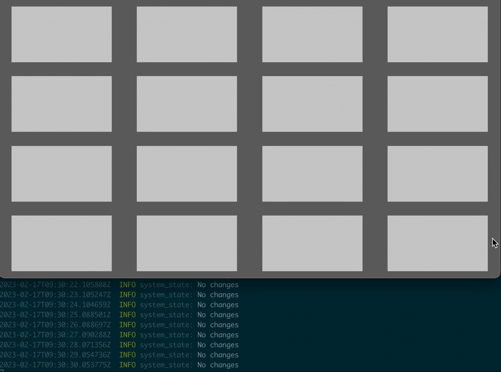

### About

This is the page with the described examples.

> **Note**
> 
> Make sure you are inspecting examples for right version.
> 
> There is the examples page for stable (published on crates.io) version:
> 
> https://github.com/jkb0o/pecs/tree/stable/examples


### [`simple`](../examples/simple.rs)
```bash
cargo run --example simple
```
This example shows how to sequentially call promises by chaining them with `then` method.
It will wait for second, make http request, wait for an response and exit the app.

### [`repeat`](../examples/repeat.rs)
```bash
cargo run --example repeat
```
This example demonstrates how to use `Promise::repeat()`
to create async loops. 

### [`custom_timer`](../examples/custom_timer.rs)
```bash
cargo run --example custom_timer
```
This Example shows how you can create custom promises
with `Promise::register()` method and resolve them from
you system with `commands.promise(id).resolve(result)`

### [`combine_vecs`](../examples/combine_vecs.rs)
```bash
cargo run --example combine_vecs
```
This example demonstrates how to use `any()`/`all()`
in different ways for combining vector of promises
and react to result when all/any of the passed
promises got resolved.

### [`confirmation`](../examples/confirmation.rs)
```bash
cargo run --example confirmation
```
This example shows how to use `pecs` for organizing UI logic
with async operations. We create `exit` button that shows
confirmation popup on press and exit app if confirmed.

The promise-based loop works like this:
```
- create exit button
- loop:     <-------------------------.
  - wait for exit button pressed      |
  - create popup with yes/no buttons  |
  - wait for yes or no pressed        |
  - repeat if no pressed -------------`
  - break loop if yes pressed --------.
- exit app  <-------------------------`
```


### [`system_state`](../examples/system_state.rs)
```bash
cargo run --example system_state
```
This example shows how promises keep the state of Bevy's system params.
We create 16 buttons and asyn loop single promise every second.
Inside the promise we log buttons with changed for the previous second
`Interaction` component by querying with Changed<Interaction> filter.
